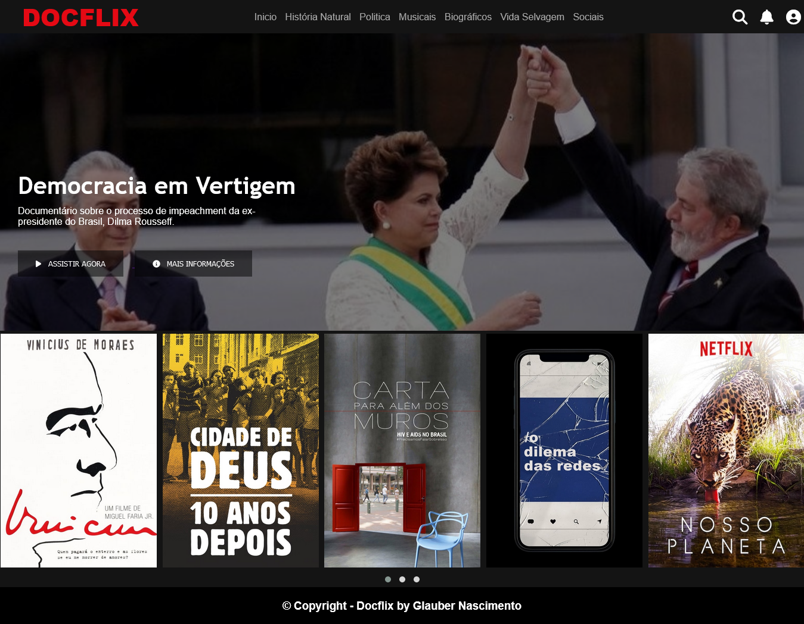

# Clone do site Netflix(DOCFLIX)

# Sobre o projeto
Este repositório foi criado para colocar em prática os conhecimentos adquiridos nos cursos de HTML, CSS e Javascript da <b>Digital Innovation One</b> no através do <i>Bootcamp HTML Web Developer<i> de um projeto de <b>Front-end Web</b>.

O objetivo do projeto foi recriar a interface do site da Netflix utilizando tecnologias simples como <b>HTML5, CSS3 e JavaScript</b>, além de englobar os conceitos de: como estruturar um layout, técnicas de CSS3 com containers e variáveis, como posicionar os elementos com Flexbox e como utilizar plugins JQuery.

# Layout do projeto

# Tecnologias utilizadas

* HTML
* CSS
* Javascript
* Jquery
* Fontawesome
* Owl Carousel

# Autor
<b>Jose Glauber do Nascimento</b>

Linkedin: https://www.linkedin.com/in/glauber-nascimento-489188170/

Github: https://github.com/GlauberN
